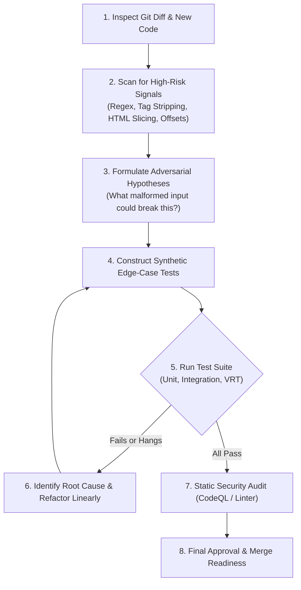

# Adversarial Code Audit & Deep Verification Skill

This skill guides rigorous code reviews, adversarial analysis, and deep verification for **Rich Markdown Diff**. It focuses on anticipating and preventing not just past bug regressions, but **novel, subtle, and structurally similar edge cases and security vulnerabilities**.

---

## 🎯 Core Philosophy: The Adversarial Mindset

When auditing or writing code in this repository, always assume:
1. **"Passing existing unit tests is merely table stakes, not proof of correctness."**
2. **"Inputs will be adversarial, malformed, deeply nested, or unusually sized."**
3. **"HTML and Markdown strings will contain deceptive characters, nested quotes, and overlapping tags."**
4. **"Performance must be $O(N)$ linear time and deterministic—never $O(2^N)$ or unbounded."**

---

## 🛡️ 6-Pillar Audit Checklist

When reviewing code changes or writing new features/parsers, audit against these 6 core pillars:

### Pillar 1: Regex Complexity & ReDoS Defense (`js/redos`, `js/bad-tag-filter`)
- [ ] **No Nested Quantifiers**: Never nest quantifiers like `((?:...)+)*`, `([\s\S]*?)+`, or `(\s*BLOCK)*`.
- [ ] **Disjoint Branch Alternatives**: If using `(A|B)+`, ensure branches `A` and `B` cannot match the same leading characters (mutually exclusive).
- [ ] **No Unbounded Whitespace in Repeated Groups**: Avoid patterns like `([\d.]+\s*)+` which backtrack exponentially on repeated spaces.
- [ ] **HTML Tag Matching**: Closing tags must match attributes and multiline whitespace (e.g. `<\/\s*tag\b[^>]*>` instead of `<\/tag>`).
- [ ] **Stateful Regex Hygiene**: When using `/g` or `/y` regular expressions, always verify `regex.lastIndex = 0` or re-initialize before reuse.
- [ ] **Linear Parsing Fallback**: For nested or paired block structures, use deterministic depth-tracking functions (e.g., `findClosing` in `src/markdown/domUtils.ts`) instead of monolithic regular expressions.

---

### Pillar 2: HTML Structural Integrity & Diff Nesting (`htmldiff`, AST)
- [ ] **No Block-in-Inline Nesting**: Verify `<del>`/`<ins>` tags wrapping block elements (e.g. `<pre>`, `<table>`, `<blockquote>`) are promoted with `.diff-block` or handled outside inline containers.
- [ ] **Table Integrity**: Tables must never be double-wrapped in `.table-scroll` or split across broken `<tr>`/`<td>` boundaries.
- [ ] **Container Type Changes**: List changes between ordered (`<ol>`), unordered (`<ul>`), and definition lists (`<dl>`) must preserve outer marker wrappers without breaking sibling items.
- [ ] **Reparented Lists**: Moving a list item between parent levels must not cause infinite loops, ghost bullets, or lost indentation.
- [ ] **Balanced Tags**: After diff post-processing, verify every opening tag has a matching closing tag in correct hierarchical order.

---

### Pillar 3: Webview Security & Sanitization Boundaries (`js/incomplete-multi-character-sanitization`, XSS)
- [ ] **Iterative Tag Stripping**: Never use single-pass `replace(/<[^>]+>/g, "")` for sanitization. Always use `stripHtmlTags()` in `src/markdown/domUtils.ts` with `do ... while` loops.
- [ ] **Sanitizer Configuration**: Ensure any rendered HTML passed to Webviews passes through `sanitizeHtml()` in `src/markdown/sanitizer.ts` with strict tag and attribute whitelists.
- [ ] **External Renderer Nonces & CSP**: Verify inline scripts, Mermaid diagrams, and KaTeX styles adhere strictly to Webview CSP nonces.
- [ ] **Webview Message Validation**: All `postMessage` handlers (e.g. `applyEdit`, `requestBlockSource`) must strictly validate `uriScheme` (block `git:`, `gitlens:`), numeric bounds (`lineStart >= 0`, `lineEnd >= lineStart`), and payload types.

---

### Pillar 4: Line Mapping & Editor Offset Accuracy (`data-line`, Quick Edit)
- [ ] **Frontmatter Offset Handling**: Changes in frontmatter (YAML/TOML) must not desynchronize `data-line` offsets of subsequent Markdown body lines.
- [ ] **Attribute Value Safety**: Ensure `data-line` injection/stripping regexes handle attributes containing `>` or quoted characters without corrupting the tag.
- [ ] **Atomic vs Granular Quick Edit**: Ensure clicking Quick Edit for a diff block replaces only the intended line range without clobbering unedited neighboring lines.
- [ ] **Marp Section Offsets**: Ensure `<section>` and `<svg>` wrappers in Marp presentations do not shift line numbers for slide content.

---

### Pillar 5: Multilingual (CJK) & Unicode Robustness
- [ ] **No Single-Byte Length Assumptions**: Avoid slicing or indexing strings assuming ASCII character widths.
- [ ] **CJK Obsidian & Tag Support**: Ensure tag matchers, hashtag extractors, and fuzzy heading comparisons handle Japanese/Chinese full-width characters and spaces.
- [ ] **Emoji & Surrogate Pairs**: Handle multi-byte emojis and backreference symbol variants (e.g. `\u21a9\ufe0e` / `↩︎`) without corrupting string slices or throwing encoding errors.
- [ ] **CJK Diff Word Segmentation**: Ensure `htmldiff` word-level splitting does not drop or split intermediate CJK characters.

---

### Pillar 6: Platform Isolation & External Dependencies
- [ ] **Sub-Shell / IDE Environment Variables**: Prevent leakage of Electron flags (e.g. ensure `ELECTRON_RUN_AS_NODE` is unset in test/runtime harnesses).
- [ ] **Cross-Platform File Paths**: Always normalize file paths with forward slashes or `path.resolve()`; avoid raw string concatenation with `\`.
- [ ] **Mocking in Headless Testing**: Ensure external renderers (Mermaid, KaTeX) provide safe, deterministic fallbacks in headless environments (Docker/CI) to prevent sandbox hangs.

---

## 🧪 Adversarial Synthetic Test Patterns (Generate & Verify)

When testing new diff logic, generate test cases using these adversarial inputs:

### Pattern A: ReDoS & Long Repeated Runs
```markdown
<!-- Test A1: Deeply nested list repetitions -->
- Item 1
  - Subitem 1
    - Sub-subitem 1
${"- Item N\n  - Subitem N\n".repeat(50)}

<!-- Test A2: Long run of sibling block elements inside diff -->
<ins>
${"<div><h3>Heading</h3><p>Paragraph</p></div>\n".repeat(40)}
</ins>
```

### Pattern B: Deceptive HTML & Quoted Tag Names
```html
<!-- Test B1: Fake closing tag inside attribute value -->
<div title="</div>" data-template="<p class='nested'>">
  Real content here
</div>

<!-- Test B2: Self-closing tag inside parent container -->
<div>
  Before <div class="self-closing" /> After
</div>
```

### Pattern C: Malicious Multi-Character Sequences
```html
<!-- Test C1: Nested script tags designed to survive single-pass replace -->
<scrip<script>alert(1)</script>t>

<!-- Test C2: Malformed closing tags with multiline whitespace or attributes -->
<script src="bad.js">
alert(1);
</script   data-extra="true" >
```

### Pattern D: Mixed CJK, Emoji & Special Characters
```markdown
# 1. 概要 (Overview) 🚀

- 項目 1: これはテストです。
- 項目 2: 変更されたテキストです。[^1]

[^1]: 脚注テスト ↩︎ (Footnote backreference with emoji variant)
```

---

## 🔄 Step-by-Step Adversarial Audit Workflow



1. **Diff Inspection**: Identify all modified regular expressions, string slicing operations, HTML replacement loops, and AST transformations.
2. **Signal Scanning**: Check against the 6 Pillars above for code smells (e.g. nested regex loops, single-pass `.replace()`, hardcoded ASCII ranges).
3. **Hypothesis Formulation**: Ask: *"How can an attacker or an unusual Markdown document freeze, inject, or misalign this code?"*
4. **Test Execution**: Write synthetic tests incorporating the Adversarial Test Patterns.
5. **Static Verification**: Run `pnpm run compile && pnpm run lint` and `npx mocha ./out/test/unit/**/*.test.js`.
6. **VRT & Security Verification**: Run visual regression and CodeQL scanning before declaring completion.
